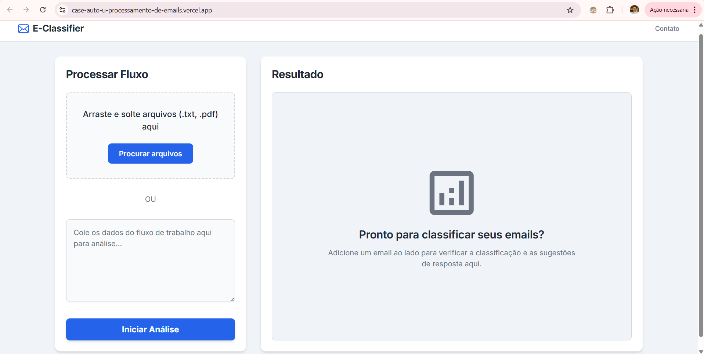

# E-Classifier - Classificador de E-mails (Desafio AutoU)

Este projeto é uma solução web _full-stack_ para o desafio de processamento de e-mails da AutoU.

A aplicação utiliza IA para realizar uma **triagem e roteamento estratégico** de e-mails, indo além da simples classificação "produtivo/improdutivo" para identificar a _intenção_ e a _urgência_ de cada mensagem.

## 🚀 Link da aplicação

| Entrega                      | Link                                                                                    |
| :--------------------------- | :-------------------------------------------------------------------------------------- |
| 🌍 **Demo Ao Vivo (Vercel)** | **[CLIQUE AQUI PARA ACESSAR](https://case-auto-u-processamento-de-emails.vercel.app/)** |

---

## 🎯 O Problema

O desafio é otimizar uma rotina de triagem manual de e-mails, onde mensagens críticas (ex: "servidor fora do ar") se misturam com e-mails de baixa prioridade (ex: "obrigado"). A simples classificação "Produtivo/Improdutivo" é insuficiente, pois ainda força uma triagem manual no "balde" de produtivos.

## 💡 Minha Solução

Desenvolvi uma aplicação que não apenas classifica, mas **prioriza e roteia**. A IA foi instruída (via Engenharia de Prompt) a agir como um agente de triagem inteligente, categorizando os e-mails em **níveis de ação de negócio**:

- `Produtivo (Urgente)`: Problemas críticos que precisam de atenção imediata.
- `Produtivo (Suporte)`: Dúvidas de usuário que podem ir para a fila de N1.
- `Produtivo (Solicitação)`: Pedidos de status ou informação.
- `Produtivo (Faturamento)`: Questões financeiras para o time correto.
- `Improdutivo`: Mensagens que podem ser arquivadas com segurança.

Isso permite que, em uma implementação futura, o sistema possa **enviar alertas no Slack** para itens urgentes, **criar tickets automaticamente** no Jira para suporte, ou simplesmente arquivar o que é ruído.

---

## 🛠️ Stack de Tecnologias Utilizadas

Esta solução é um _monorepo_ full-stack servido pela Vercel.

| Área                        | Tecnologia                                  | Propósito                                                          |
| :-------------------------- | :------------------------------------------ | :----------------------------------------------------------------- |
| **Frontend**                | HTML5, Tailwind CSS, JavaScript (Fetch API) | Interface limpa, responsiva e experiência do usuário (UX).         |
| **Backend**                 | Python 3, FastAPI                           | API de alta performance, servindo o frontend e os endpoints de IA. |
| **Inteligência Artificial** | Groq API (Llama 3.1)                        | Classificação e geração de resposta com latência ultrabaixa.       |
| **Processamento de Dados**  | PDFPlumber, Regex                           | Extração de texto de PDFs e limpeza de e-mails (Sinal vs. Ruído).  |
| **Hospedagem**              | Vercel                                      | Deploy contínuo (CI/CD) e hospedagem da aplicação _serverless_.    |

---

## 🧠 Decisões Técnicas e Estratégicas

1.  **Engenharia de Prompt Estratégica:** Em vez de um prompt simples, criei um `SYSTEM_PROMPT` robusto que força a IA a agir como um **agente de triagem**. Ele classifica em 5 categorias de negócio e retorna um JSON estruturado com uma `reasoning` (justificativa).

2.  **Limpeza de E-mail (Sinal vs. Ruído):** A função `clean_email_text` usa Regex para isolar o "sinal" (a nova mensagem) do "ruído" (assinaturas, replies anteriores, disclaimers). Isso reduz o custo de tokens e, mais importante, **aumenta drasticamente a precisão da IA**, impedindo que ela se confunda com o texto de e-mails antigos.

3.  **Groq:** A escolha pela API da Groq foi uma decisão de negócio focada na **experiência do usuário (UX)**. Para uma ferramenta de produtividade ser útil, ela precisa ser instantânea. A plataforma Groq entrega a classificação da IA em uma fração de segundo. Isso é essencial para que a solução seja prática, fluida e **realmente adotada pela equipe** no dia-a-dia, eliminando frustrações com telas de carregamento e provando que a IA pode ser uma assistente ágil, não um gargalo.

4.  **UX de Categoria:** A IA retorna categorias técnicas (ex: `URGENT_SUPPORT`). O frontend (`assets/js/script.js`) traduz isso para rótulos amigáveis (ex: "Produtivo (Urgente)"), mostrando uma separação clara entre a lógica de backend e a apresentação de frontend.

---

## 🚀 Jornada de Desenvolvimento (Roadmap)

Este projeto foi construído seguindo as seguintes etapas:

- **Etapa 1:** Criação e configuração do Front-end em HTML, Tailwind CSS e JavaScript.

- **Etapa 2:** Análise e estudo de implementação do FastAPI e conceitos de NLP para o desafio.

- **Etapa 3:** Criação do Back-end com FastAPI, integrando a API Groq e a lógica de processamento de PDF e limpeza de texto.

- **Etapa 4:** Resolução de problemas, depuração de lógica (ex: limpeza de e-mail, validação de UX) e refinamento do prompt da IA para triagem estratégica.

- **Etapa 5:** Deploy na Vercel, incluindo configuração de `CORS`, `vercel.json` e `requirements.txt`.

- **Etapa 6:** Iteração final e melhoramento do `README.md` para documentar as decisões estratégicas do projeto.

## Finalização

Agradeço o tempo dedicado à revisão deste projeto.

Estou à disposição para discutir em detalhe as decisões técnicas e de negócio implementadas nesta solução, assim como explorar futuras iterações e melhorias.
